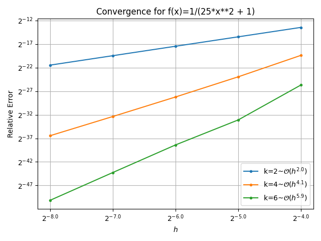

# Piecewise Polynomial Quadrature Formulae
A family of quadrature formulae based on piecewise polynomial interpolation.
I am not aware of this quadrature rule being previously discovered.
Trapezoidal rule is a special case.
This is distinct from spline based quadratures.
I haven't proven convergence orders, but I expect them to be prescribed by the stencil size parameter.

# Some Sample QF on equally spaced points.
For even orders, the weights are symmetric, and far enough from the boundary all weights are $\frac{1}{h}$.

For $\mathcal{O}(h^2)$:
$\frac{1}{2h} \big[ 1 \ 2 \ 2 \ 2 \ 2 ...$

For $\mathcal{O}(h^4)$:
$\frac{1}{24h} \big[ 8 \ 31 \ 20 \ 25 \ 24 \ 24 \ 24 ...$

For $\mathcal{O}(h^6)$:
$\frac{1}{1440h} \big[ 459 \ 1982 \ 944 \ 1746 \ 1333 \ 1456 \ 1440 \ 1440 \ 1440 ...$

We can present these weights in a standardized format: choose a grid to be the positive integers (so $h=1$) and only report the weights that differ from 1. We then have
<table>
	<tr>
		<td>$\mathcal{O}(2)$</td>
		<td>$\frac{1}{2}$</td>
	</tr>
	<tr>
		<td>$\mathcal{O}(3)$</td>
		<td>$\frac{3}{8}$</td>
		<td>$\frac{7}{6}$</td>
		<td>$\frac{23}{24}$</td>
	</tr>
	<tr>
		<td>$\mathcal{O}(4)$</td>
		<td>$\frac{1}{3}$</td>
		<td>$\frac{31}{24}$</td>
		<td>$\frac{5}{6}$</td>
		<td>$\frac{25}{24}$</td>
	</tr>
	<tr>
		<td>$\mathcal{O}(5)$</td>
		<td>$\frac{95}{288}$</td>
		<td>$\frac{317}{240}$</td>
		<td>$\frac{23}{30}$</td>
		<td>$\frac{793}{720}$</td>
		<td>$\frac{157}{160}$</td>
	</tr>
	<tr>
		<td>$\mathcal{O}(6)$</td>
		<td>$\frac{51}{160}$</td>
		<td>$\frac{991}{720}$</td>
		<td>$\frac{59}{90}$</td>
		<td>$\frac{97}{80}$</td>
		<td>$\frac{1333}{1440}$</td>
		<td>$\frac{91}{90}$</td>
	</tr>
	<tr>
		<td>$\mathcal{O}(7)$</td>
		<td>$\frac{5257}{17280}$</td>
		<td>$\frac{22081}{15120}$</td>
		<td>$\frac{54851}{120960}$</td>
		<td>$\frac{103}{70}$</td>
		<td>$\frac{89437}{120960}$</td>
		<td>$\frac{16367}{15120}$</td>
		<td>$\frac{23917}{24192}$</td>
	</tr>
	<tr>
		<td>$\mathcal{O}(8)$</td>
		<td>$\frac{278}{945}$</td>
		<td>$\frac{185153}{120960}$</td>
		<td>$\frac{3667}{15120}$</td>
		<td>$\frac{8167}{4480}$</td>
		<td>$\frac{733}{1890}$</td>
		<td>$\frac{156451}{120960}$</td>
		<td>$\frac{2777}{3024}$</td>
		<td>$\frac{905}{896}$</td>
	</tr>
	<tr>
		<td>$\mathcal{O}(9)$</td>
		<td>$\frac{25713}{89600}$</td>
		<td>$\frac{1153247}{725760}$</td>
		<td>$\frac{130583}{3628800}$</td>
		<td>$\frac{903527}{403200}$</td>
		<td>$- \frac{797}{5670}$</td>
		<td>$\frac{6244961}{3628800}$</td>
		<td>$\frac{56621}{80640}$</td>
		<td>$\frac{3891877}{3628800}$</td>
		<td>$\frac{1028617}{1036800}$</td>
	</tr>
	<tr>
		<td>$\mathcal{O}(10)$</td>
		<td>$\frac{81385}{290304}$</td>
		<td>$\frac{5982811}{3628800}$</td>
		<td>$- \frac{105103}{518400}$</td>
		<td>$\frac{3384373}{1209600}$</td>
		<td>$- \frac{27673}{28350}$</td>
		<td>$\frac{371081}{145152}$</td>
		<td>$\frac{175523}{1209600}$</td>
		<td>$\frac{4758181}{3628800}$</td>
		<td>$\frac{6767167}{7257600}$</td>
		<td>$\frac{14269}{14175}$</td>
	</tr>
	<tr>
		<td>$\mathcal{O}(11)$</td>
		<td>$\frac{4777223}{17418240}$</td>
		<td>$\frac{19494601}{11404800}$</td>
		<td>$- \frac{21664009}{45619200}$</td>
		<td>$\frac{20082647}{5702400}$</td>
		<td>$- \frac{357595981}{159667200}$</td>
		<td>$\frac{101509}{24948}$</td>
		<td>$- \frac{177536819}{159667200}$</td>
		<td>$\frac{80938271}{39916800}$</td>
		<td>$\frac{212182463}{319334400}$</td>
		<td>$\frac{255314179}{239500800}$</td>
		<td>$\frac{783809}{788480}$</td>
	</tr>
	<tr>
		<td>$\mathcal{O}(12)$</td>
		<td>$\frac{1657}{6160}$</td>
		<td>$\frac{1693103359}{958003200}$</td>
		<td>$- \frac{183182141}{239500800}$</td>
		<td>$\frac{155823623}{35481600}$</td>
		<td>$- \frac{52948363}{13305600}$</td>
		<td>$\frac{41542229}{6386688}$</td>
		<td>$- \frac{54633}{15400}$</td>
		<td>$\frac{601537459}{159667200}$</td>
		<td>$- \frac{2733413}{13305600}$</td>
		<td>$\frac{48112633}{35481600}$</td>
		<td>$\frac{44838553}{47900160}$</td>
		<td>$\frac{38522153}{38320128}$</td>
	</tr>
	<tr>
		<td>$\mathcal{O}(13)$</td>
		<td>$\frac{106364763817}{402361344000}$</td>
		<td>$\frac{681136420843}{373621248000}$</td>
		<td>$- \frac{1401331298077}{1307674368000}$</td>
		<td>$\frac{2832366494131}{523069747200}$</td>
		<td>$- \frac{438200202533}{69742632960}$</td>
		<td>$\frac{4442934458299}{435891456000}$</td>
		<td>$- \frac{1965283}{250250}$</td>
		<td>$\frac{3251907989573}{435891456000}$</td>
		<td>$- \frac{125285857217}{49816166400}$</td>
		<td>$\frac{249304895401}{104613949440}$</td>
		<td>$\frac{820902291229}{1307674368000}$</td>
		<td>$\frac{2775843989651}{2615348736000}$</td>
		<td>$\frac{473293717537}{475517952000}$</td>
	</tr>
	<tr>
		<td>$\mathcal{O}(14)$</td>
		<td>$\frac{27770156197}{106748928000}$</td>
		<td>$\frac{4910982739693}{2615348736000}$</td>
		<td>$- \frac{1830414679453}{1307674368000}$</td>
		<td>$\frac{17308443934079}{2615348736000}$</td>
		<td>$- \frac{3239871500473}{348713164800}$</td>
		<td>$\frac{6802893055867}{435891456000}$</td>
		<td>$- \frac{105610027}{7007000}$</td>
		<td>$\frac{130582029653}{8895744000}$</td>
		<td>$- \frac{13824839392867}{1743565824000}$</td>
		<td>$\frac{2819830208717}{523069747200}$</td>
		<td>$- \frac{752403440483}{1307674368000}$</td>
		<td>$\frac{3634010752403}{2615348736000}$</td>
		<td>$\frac{4920175305323}{5230697472000}$</td>
		<td>$\frac{28145907}{28028000}$</td>
	</tr>
	<tr>
		<td>$\mathcal{O}(15)$</td>
		<td>$\frac{25221445}{98402304}$</td>
		<td>$\frac{7577074249153}{3923023104000}$</td>
		<td>$- \frac{109758975737401}{62768369664000}$</td>
		<td>$\frac{2619716486083}{326918592000}$</td>
		<td>$- \frac{823993097730133}{62768369664000}$</td>
		<td>$\frac{3652938751549}{156920924160}$</td>
		<td>$- \frac{185364174597109}{6974263296000}$</td>
		<td>$\frac{362611972}{13030875}$</td>
		<td>$- \frac{406567190928929}{20922789888000}$</td>
		<td>$\frac{5691974352499}{435891456000}$</td>
		<td>$- \frac{11068437145699}{2510734786560}$</td>
		<td>$\frac{2729565317047}{980755776000}$</td>
		<td>$\frac{12392155500563}{20922789888000}$</td>
		<td>$\frac{4149740674111}{3923023104000}$</td>
		<td>$\frac{687122652947}{689762304000}$</td>
	</tr>
	<tr>
		<td>$\mathcal{O}(16)$</td>
		<td>$\frac{69181108}{273648375}$</td>
		<td>$\frac{124527838997953}{62768369664000}$</td>
		<td>$- \frac{8301345801121}{3923023104000}$</td>
		<td>$\frac{602923312676921}{62768369664000}$</td>
		<td>$- \frac{1596315823547}{89159616000}$</td>
		<td>$\frac{2120764633122901}{62768369664000}$</td>
		<td>$- \frac{172974549513301}{3923023104000}$</td>
		<td>$\frac{21497071030031}{426995712000}$</td>
		<td>$- \frac{53570696141}{1277025750}$</td>
		<td>$\frac{1918959527598691}{62768369664000}$</td>
		<td>$- \frac{58518753821611}{3923023104000}$</td>
		<td>$\frac{474505422337963}{62768369664000}$</td>
		<td>$- \frac{980645013239}{980755776000}$</td>
		<td>$\frac{8132582533301}{5706215424000}$</td>
		<td>$\frac{528870628631}{560431872000}$</td>
		<td>$\frac{1285469654383}{1280987136000}$</td>
	</tr>
</table>

This form makes it easy to compare to, for example, the [Gregory weights](https://www.colorado.edu/amath/sites/default/files/attached-files/gregory.pdf).

# Piecewise Polynomial Interpolation
This quadrature is an interpolation based quadrature.
The interpolants found are piecewise polynomials with breakpoints at the nodes.
The interpolants will be continuous, but we do not enforce any degree of smoothness over the break points (unlike splines).

Select a target order $k$.
Over each subdomain $(x_{i}, x_{i+1})$ we select the $k$ closest nodes to this interval to be our *stencil*.
We interpolate the stencil points with a dregree $k-1$ polynoial, then restrict the domain of this polynomial to the subdomain.

These quadrature rules are equivalent to integrating exactly this resulting interpolant.

# Not Splines
These interpolants are not the traditional splines.
Like splines, they are continuous piecewise polynomials.
Unlike splines, they do not enforce smoothness.
The figure below compares a function to the local interpolant (our interpolant) of degree 3 and also to a cubic spline with not-a-not boundary conditions.
It also plots the first and second derivatives of each of these functions.

Note that the second derivative of the local interpolant is discontinuous at some of the breakpoints.
This demonstrates that it is distinct from splines.

We can also compare the cardinal basis for the space of interpolants to the cardinal spline basis.

We see from the cardinal basis that the local interpolant is not smooth over the breakpoints.
It is not easy to see from this plot, but the cubic spline basis functions are supported over the entire interval.
A consequence of this is that the interpolant over each piece depends on all of the function values over the entire interval.
In contrast, the cardinal basis functions for local interpolation are supported only over a continguous set of $k-$ sub domains.
This means that an individual piece of the interpolant is only sensitive to nearby function values.
It is also the reason for the repeated quadrature weights far from the boundary, as the cardinal basis functions are simply translates of one another.

# Convergence
I've tested convergence of the even order equally spaced quadrature formulae above on several test functions. 

We see that convergence is roughly $\mathcal{O}(h^k)$ for smooth functions.

We avoid error from Runge's phenomenon.

Furthermore we are exact up to numerical error on polynomials of degree less than $k$.

Lastly, convergence is limited by the smoothness of our function.

